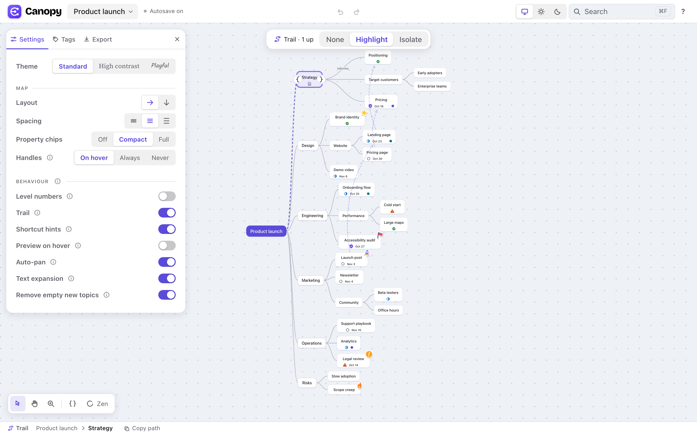
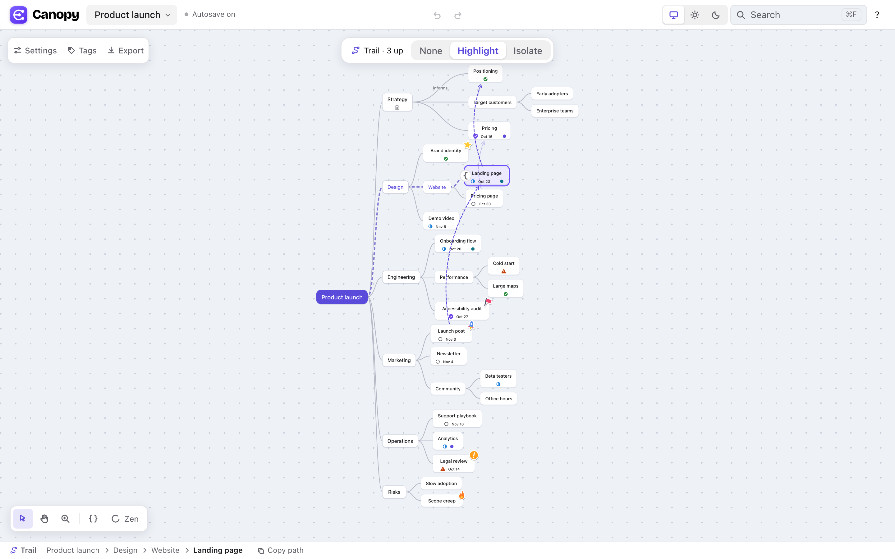
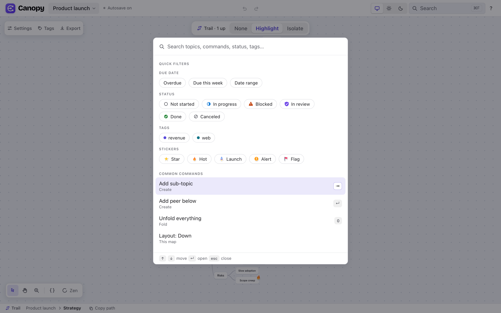
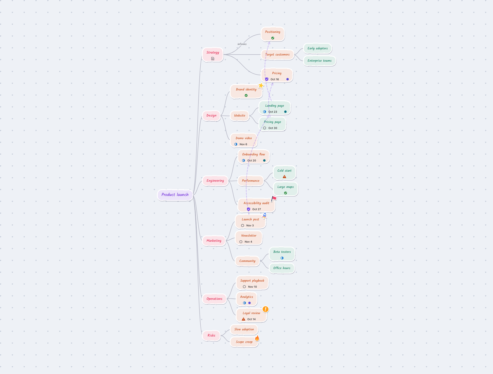
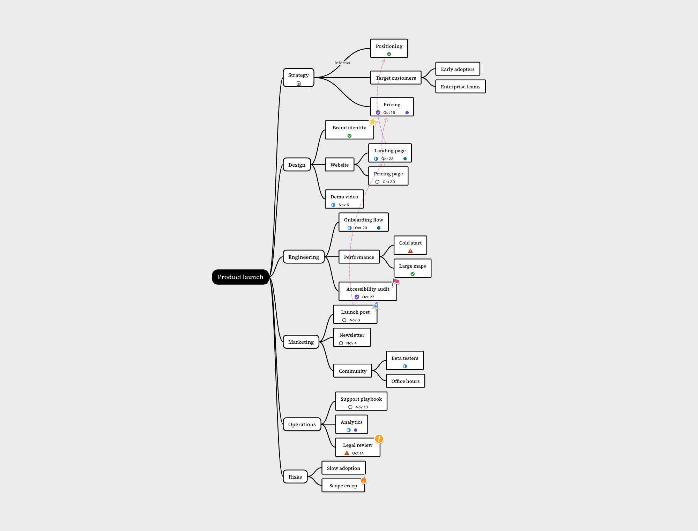
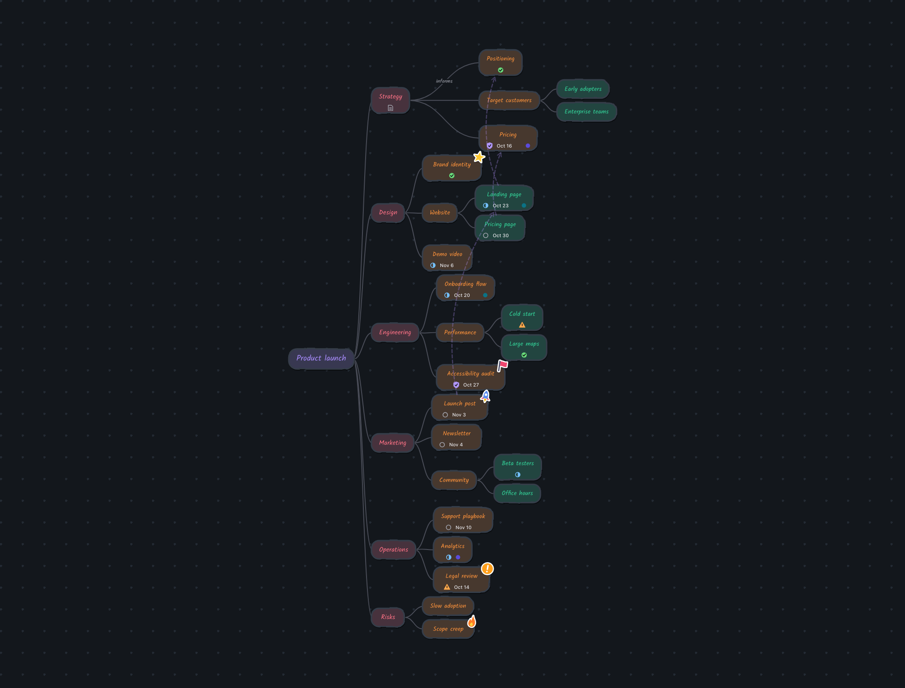
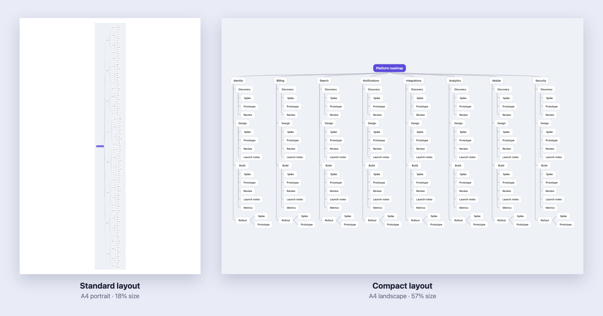
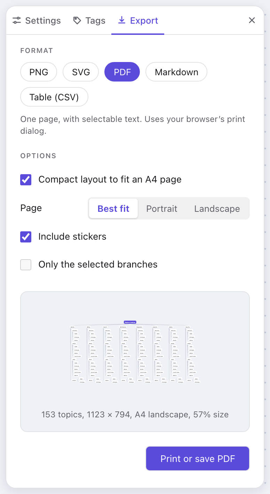

<div align="center">


# Canopy

**A fast, keyboard-first mind map that doubles as a light planning tool.**
Local-first, private by default, accessible to the core, and a pleasure to look at.

[](https://github.com/vijayjangid/canopy/actions/workflows/pages.yml)


<br />



</div>

<br />

## ✨ Why Canopy

Most mind-mapping tools make you choose between a pretty doodle and a useful plan. Canopy is built so a map can be both, without ever getting in your way.

|                                         |                                                                                                                            |
| --------------------------------------- | -------------------------------------------------------------------------------------------------------------------------- |
| ⌨️ **Keyboard-first, mouse-delightful** | Every action has a shortcut. The mouse gets rich affordances (ghost previews, magnetic drops), not a separate feature set. |
| 🎨 **Structure and style are separate** | Theme and colour mode never touch your data. Restyle a whole map in one click.                                             |
| 🎬 **Motion explains, never decorates** | New topics grow out of their parent and removed ones fold back. Your system's reduced-motion setting is respected.         |
| ♿ **Accessible by default**            | The map is a real ARIA tree, not just pixels on a canvas. Automated axe checks run in the test suite.                      |
| 🔒 **Local-first and private**          | Works offline, autosaves to your browser, and needs no account. Your map is a plain `.canopy.json` file.                   |
| 📋 **A map is also a plan**             | Give any topic a status, due date and tags, then filter, roll up and export it without leaving the map.                    |

<br />

## 🚀 Feature tour

### 🌱 Grow ideas at the speed of thought

- **Growth handles** appear on hover. Click to add, or drag to drop with a magnetic snap and a **ghost preview** of exactly where the new topic will land. Turn on **Preview on hover** in Settings to see the ghost while merely pointing at a `+` (off by default).
- **New map** (File menu) opens with its central topic ready to name, so you can start typing at once.
- `Tab` adds a sub-topic, `Enter` a peer, `W` inserts a topic **between** a topic and its parent. No dragging needed.
- **Text expansion:** type `!!Research>Interviews>Synthesis` for a chain, or `!!A, B, C` for peers. One undo puts the text back.
- **Paste an outline** (indented text or Markdown bullets) onto any topic and it unfurls into a branch.
- **Drag to re-parent** with a clear drop line that shows whether you are making a sub-topic or a peer.

### 🧭 Never lose your place in a big map

- **Trail** highlights (or isolates) the path from the focused topic up to the Core, with a clickable breadcrumb and **Copy path**. The lines march toward the Core and the topics on the way set their text in the interactive colour.
- **Branch view** (`[`) shows only one branch and collapses everything above it into a single dotted node.
- **References** link a topic to other existing topics without duplicating a branch, as many as you like in and out. Faded dashed arcs ending in a "V" tell them apart from parent-child lines, and they come up in full when you point at them or at a topic they join. Drag from the link handle above a selected topic onto any topic to connect them, or click the handle (or press `X`) to search by name or path. Click a line to show its red delete icon, or right-click it to go to either end, add another or remove it.
- **Search** (`⌘F`, `⌘K`, `F` or `/`) is one box for topics, commands and filters. Type to find a topic by title or path, run a command, or filter the map by status, tag, sticker or due date. Empty, it shows quick filters, your recent searches and common commands.
- **Fold** with `]`, fold the whole map to **Level N** with `1`–`9`, and peek inside a folded branch from its badge.
- **Zen** (`Z`) hides every panel until you press `Esc` or click **Exit Zen**, which sits in the bottom left where the toolbar was. **Auto-pan** keeps the topic you are working on in view.
- **Zoomed out, topics become icons** so the map stays readable at a glance: a house for the Core, a **T** for text-only topics, the status mark for topics with a status, a picture mark for pictures, a page for notes, and small dots for tags and due dates.
- The same search runs **every action**, shows its shortcut, and covers settings too.

<table>
  <tr>
    <td width="50%"></td>
    <td width="50%"></td>
  </tr>
  <tr>
    <td align="center"><sub><b>Trail and details panel</b>: follow the path to the Core while you edit properties.</sub></td>
    <td align="center"><sub><b>Search</b> (<code>⌘F</code>): quick filters, recent searches and common commands.</sub></td>
  </tr>
</table>

### 📌 Turn the map into a plan

- **Properties:** Status (Not started, In progress, Blocked, In review, Done, Canceled), Due date and Tags, shown as compact chips.
- **Shorthand while typing:** `#launch /doing ^fri` becomes a tag, a status and a due date when you finish the title.
- **Roll-ups:** a folded branch shows its hidden count plus a status summary such as `12 · 3/7`.
- **Filters** pick out topics by property, text or sticker, and step through matches with `.` and `,`. Exports can respect the active Filter.

### 🎭 Make it yours: Themes and colour modes

Three **Themes**, each a ready-made preset of colour, shape and font, in Light, Dark or Auto. Your data never changes.

<table>
  <tr>
    <td width="33%"></td>
    <td width="33%"></td>
    <td width="33%"></td>
  </tr>
  <tr>
    <td align="center"><sub><b>Playful</b><br />sticker topics, colour by level</sub></td>
    <td align="center"><sub><b>High Contrast</b><br />level by shape, not just colour</sub></td>
    <td align="center"><sub><b>Playful</b> in Dark<br />charcoal stickers</sub></td>
  </tr>
</table>

- **Standard:** the default. A clean system font, soft borders and the interactive colour for emphasis.
- **High Contrast:** black on white, thick strokes, a serif font and a different corner shape per level, so level is never carried by colour alone.
- **Playful:** every topic is a **sticker**. The title is set in a handwritten font, in its level's colour, on a tinted face inside a wavy white rim with a flat shadow. In Dark mode the stickers turn charcoal on the darkest canvas. Lines are drawn slightly wobbly, like a hand-drawn map.
- **Colour mode:** Auto, Light or Dark, one click from the top bar. It belongs to your device, not to the map.
- **Layout:** Right or Down, in Compact, Comfortable or Airy spacing. Connectors are always curved.
- **Pictures:** paste any image from the clipboard (a screenshot, a copied image) onto the selected topic. The topic grows to fit it, up to a maximum size, and larger pictures are scaled down and stored inside the map file. Pasting works while you are typing the title too. Point at the picture for an **Alt** button (describe it for screen readers) and a **✕** button (remove it), or use the right-click menu. Pictures appear in SVG, PNG and PDF exports.
- **Drag and drop:** drop a picture on the canvas to add it as a new topic under the Core, or on a topic to put it on that topic. Drop a Canopy map file (`.canopy.json`) on a topic, or on the canvas for the Core, to add the whole map as a new branch, so explored maps can be combined into a bigger one. The topic it will land on is outlined while you drag. File ▸ **Add a map as a branch…** does the same from the keyboard.
- **Stickers:** original die-cut artwork on the corners of topics, and on the **lines** between them. Each sticker is a switch: click it to put it on, click it again to take it off, and a sticker goes on a topic or line only once. Lines can carry a label such as _depends on_, and the bar beside a picked line has a pencil that jumps to the label field. The sticker sheet sits in the details panel under its own heading.
- **Delete with care:** deleting a topic that has sub-topics asks whether to remove **the whole branch** or **only the topic**, in which case its sub-topics move up to its parent, in its place.
- **Notes:** a Markdown note on any topic, with a Write and Preview switch.

<br />

## 📄 Compact layout for print and export

Big maps print badly: a tidy tree grows tall and thin, and shrinks to an unreadable sliver on a page. The **Compact layout** option moves topics around so the map fills an **A4** page, then shrinks it only as far as it has to.

<div align="center">

</div>

<table>
  <tr>
    <td width="260" valign="top"></td>
    <td valign="top">

**How it decides.** Every branch picks the arrangement that wastes the least room:

- 📚 a **column** beside its parent,
- 📊 a **row** under it,
- 🗂️ or **indented** under it like an outline.

The top topic can also split its branches onto **both sides**, and the layout tries portrait and landscape to see which scales larger. A map that already fits at full size is left exactly as drawn. Branches with a labelled line keep their room for the label.

**Where it works.** PNG, SVG and PDF, with **Best fit**, **Portrait** or **Landscape** pages. It also works with **Only the selected branches**. The map on screen is never changed, and the preview tells you the page and the size, for example _A4 landscape, 57% size_.

</td>
  </tr>
</table>

### 📤 Everything you can export

| Format       | What you get                                                                                         |
| ------------ | ---------------------------------------------------------------------------------------------------- |
| **PNG**      | 1×, 2× or 4×, optional transparent background. The scale lowers itself if a canvas would be too big. |
| **SVG**      | Vector, follows the Theme, level numbers and folds, with the map's font embedded.                    |
| **PDF**      | One page, vector, selectable text, through the browser's print dialog.                               |
| **Markdown** | A nested outline with optional notes, and properties written as the inline shorthand.                |
| **CSV**      | One row per topic with its path and properties. Spreadsheet formulas are defused.                    |
| **JSON**     | `canopy/1`, versioned and lossless. Export then import gives you the same map back.                  |

<br />

## ⌨️ Shortcuts worth learning

Press `?` in the app for the searchable cheat sheet. A hint strip at the bottom always shows what applies to your selection.

| Action                       | Keys               | Action                    | Keys                  |
| ---------------------------- | ------------------ | ------------------------- | --------------------- |
| Add sub-topic / peer         | `Tab` / `Enter`    | Search and commands       | `⌘F` or `⌘K`          |
| Insert between levels        | `W` / `Shift+W`    | Export                    | `⌘E`                  |
| Edit / finish editing        | `Space` / `⌘Enter` | Settings                  | `⌘,`                  |
| Fold / Branch view           | `]` / `[`          | Search topics and filters | `F` or `/`            |
| Reference another topic      | `X`                |                           |                       |
| Fold to Level N / unfold all | `1`–`9` / `0`      | Trail on or off           | `R`                   |
| Status / Due / Tag           | `T` / `D` / `G`    | Zen                       | `Z`                   |
| Note / Sticker / Line label  | `N` / `S` / `L`    | Select / Pan / Zoom tool  | `V` / `H` / `Shift+Z` |
| Duplicate / Delete topic     | `⌘D` / `Del`       | Undo / Redo               | `⌘Z` / `⌘⇧Z`          |

<br />

## 🏁 Getting started

You need **Node.js 20.19 or newer** (or 22.12+).

```bash
git clone git@github.com:vijayjangid/canopy.git
cd canopy
npm install
npm run dev
```

Then open the address Vite prints (usually <http://localhost:5173>).

> 💡 **Try a big map.** In development, add `?demo=200&plan=1` to the address to open a generated map with 200 topics and planning properties. It is handy for trying Trail, Filters and the compact export.

### Scripts

| Command               | What it does                                              |
| --------------------- | --------------------------------------------------------- |
| `npm run dev`         | Start the dev server.                                     |
| `npm run build`       | Typecheck, then build to `dist/`.                         |
| `npm run preview`     | Serve the production build locally.                       |
| `npm test`            | Unit and component tests (Vitest).                        |
| `npm run test:e2e`    | End-to-end tests with an accessibility scan (Playwright). |
| `npm run check`       | Typecheck, lint, format check and unit tests in one go.   |
| `npm run bench`       | Performance benchmark for large maps.                     |
| `npm run screenshots` | Make the pictures in `docs/screenshots/` again.           |

### Updating the screenshots

The pictures in this README are made by a script, so they can be made again whenever the look of the app changes:

```sh
npm run screenshots              # all of them, in about 12 seconds
npm run screenshots -- -g hero   # only the ones whose name matches
```

It starts the dev server if one is not running, builds a demo map, and writes the pictures into [`docs/screenshots/`](docs/screenshots). The demo maps are plain data in [`scripts/screenshots/maps.ts`](scripts/screenshots/maps.ts), and each picture is one test in [`scripts/screenshots/screenshots.spec.ts`](scripts/screenshots/screenshots.spec.ts). Look at the new pictures, then commit them. The script also prints the sizes quoted in the Compact layout section above, so update those numbers if they changed. It is not part of `npm test`.

### Hosting

`npm run build` produces a static site in `dist/` that works from any path, so it can be hosted on any static host. The repository includes a [GitHub Actions workflow](.github/workflows/pages.yml) that builds on every push and can publish to GitHub Pages when you run it by hand.

<br />

## 🧱 Under the hood

Canopy renders its own canvas instead of using a diagramming library, so layout, hit-testing and export all share one source of truth.

| Area        | Folder                      | Notes                                                                                            |
| ----------- | --------------------------- | ------------------------------------------------------------------------------------------------ |
| Data model  | `src/model`                 | Normalised topic table with pure, immutable operations (Immer). Undoable. Versioned file format. |
| Layout      | `src/layout`                | Tidy-tree layout for variable-size topics, connectors, and the compact A4 packer.                |
| Canvas      | `src/canvas`                | Pan and zoom, culling, drag and drop, Growth Handles, layout animator.                           |
| Editor      | `src/editor`                | Commands, keyboard, clipboard and one shortcut registry that also builds the cheat sheet.        |
| Interface   | `src/ui`                    | Panels, details panel, search, export dialog.                                                    |
| Export      | `src/io`                    | SVG built straight from the layout, PNG rasteriser, print, Markdown and CSV writers.             |
| Persistence | `src/persistence`           | Autosave to IndexedDB (Dexie) and `.canopy.json` files.                                          |
| Theme       | `src/theme`, `src/stickers` | Theme presets (colour, shape and font) and the original sticker artwork.                         |

**Stack:** React 19, TypeScript, Vite, Zustand, Immer, Dexie. Tested with Vitest, Testing Library, fast-check and Playwright with axe.

**Performance:** the canvas culls what is off screen, skips animation on very large maps, and is built to stay smooth at thousands of topics.

<br />

## 🗺️ Status and roadmap

Canopy is under active development. The core editor, planning properties, Themes, navigation aids and all export formats are built. Still ahead:

- 🧩 more Flows (Left, Both, Radial) and a per-branch Flow override
- 🗃️ Board, Table and Timeline views over the same map
- 📥 OPML and CSV import
- ⌨️ customisable shortcuts

The full picture lives in [`spec.md`](spec.md) (what the product is and how it behaves) and [`plan.md`](plan.md) (milestones and decisions).

<br />

## 🙏 Credits

Fonts are bundled through [Fontsource](https://fontsource.org) under the SIL Open Font License: Kalam, Source Serif 4, JetBrains Mono and Bricolage Grotesque. The stickers and interface icons are original artwork drawn for Canopy. See [`THIRD_PARTY_NOTICES.md`](THIRD_PARTY_NOTICES.md) for details.

<div align="center">
<br />
<sub>Built with care for people who think in branches. 🌳</sub>
</div>
